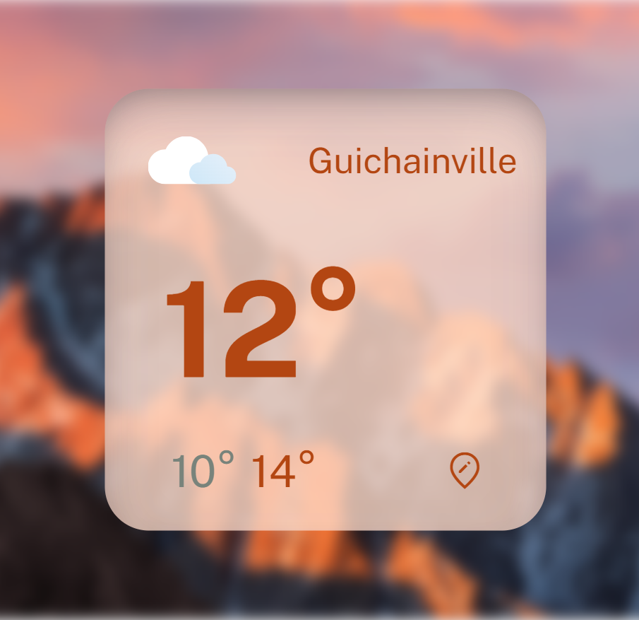
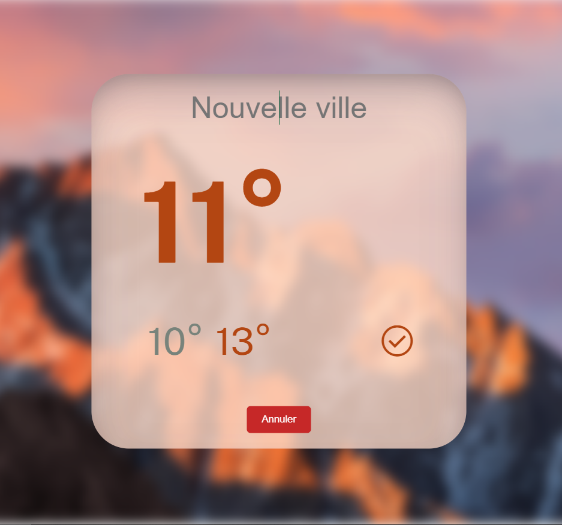

# Widget Météo

## Description
Le Widget Météo est un outil pratique pour obtenir rapidement les informations météorologiques de votre ville préférée. Avec une interface claire et intuitive, il affiche le nom de la ville sélectionnée, un logo représentant les conditions météorologiques actuelles, la température en temps réel ainsi que les températures minimale et maximale prévues.

## Fonctionnalités
- Affichage du nom de la ville
- Logo représentant les conditions météorologiques actuelles
- Température en temps réel
- Températures minimale et maximale prévues
- Bouton de modification de la ville pour actualiser les données météorologiques
- Deux boutons permettant de basculer entre deux thèmes de couleur : bleu et rouge

## Captures d'écran

## Utilisation
1. Accédez au widget via le lien suivant : [Widget Météo](https://app-widget-git-main-maxime-camaille.vercel.app/).
2. Sélectionnez la ville dont vous souhaitez obtenir les informations météorologiques en cliquant sur l'icône de modification de la ville.
3. Observez les informations météorologiques affichées : nom de la ville, logo représentant les conditions météorologiques actuelles, température en temps réel, températures minimale et maximale prévues.
4. Utilisez les boutons de thème pour personnaliser l'apparence du widget selon vos préférences.

